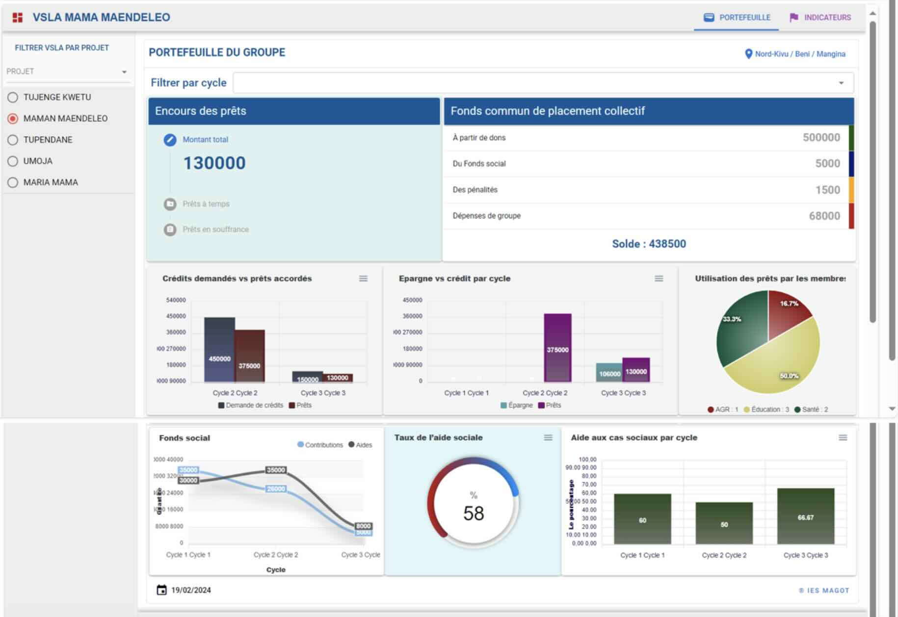
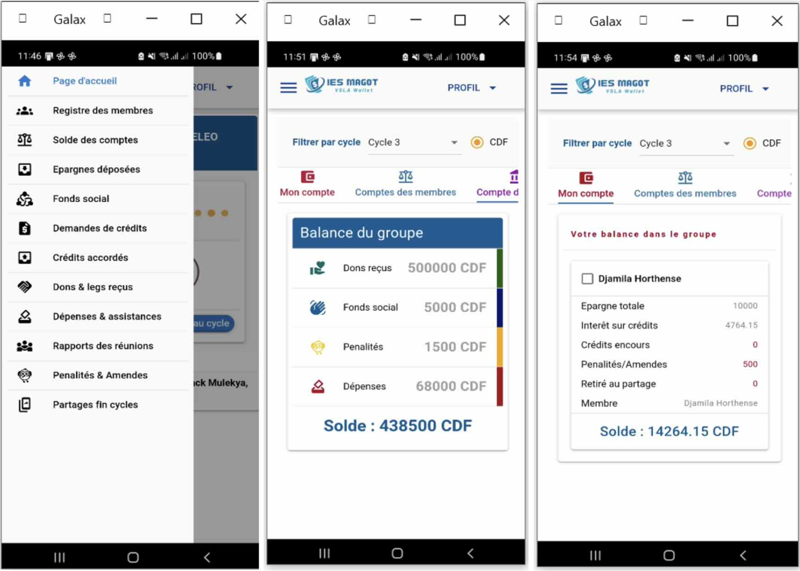

# 🏦 IES MAGOT: Financial Inclusion & Economic Recovery Platform

**IES MAGOT** is a dual-platform solution (Web & Mobile) designed to digitize and scale the **Village Savings and Loan Associations (VSLA)** model. It bridges the gap between development organizations and community-based savings groups to foster financial inclusion in real-time.

---

## 🌍 The Vision
The platform aims to modernize the traditional VSLA/AVEC approach by providing transparency, real-time data tracking, and financial empowerment to both implementing organizations and community members.

---

## 🛠️ Tech Stack

* **Frontend (Web & Mobile):** [Quasar Framework](https://quasar.dev/) & **Cordova** – A single codebase powering both the web dashboard and the Android/iOS mobile application.
* **Backend:** PHP (REST API) – Managing secure data exchange and complex financial logic.
* **Database:** MySQL – Relational storage for transactions, member profiles, and project indicators.
* **Resources:** [View Technical Datasheet (Canva)](https://www.canva.com/design/DAF77AGnK8k/NR2-hxg_1HXOsVMaaRLDhg/view)

---

## 🚀 Key Features

### 🏢 For Organizations (Web Platform)
* **Strategic Planning:** Register and manage multiple financial inclusion projects.
* **VSLA Mapping:** Digital registration and geolocation of savings groups.
* **Real-time Monitoring:** Global and granular dashboards to track savings, loans, and emergency fund indicators across all groups.

### 👥 For Community Members (Mobile App)
* **Personal Wallet Tracking:** Each member can follow their savings progress, outstanding shares, and social fund contributions.
* **Transaction Transparency:** Instant access to personal financial history within the VSLA.
* **Mobile-First Design:** Optimized for smartphones to ensure accessibility in community settings.

---

## 📂 Architecture

- `/mobile-app`: Quasar + Cordova source code for the Android/iOS application.
- `/web-dashboard`: Quasar-based administrative interface.
- `/api-backend`: PHP-based API handling business logic and synchronization.

---

## 📈 Impact & Indicators
The platform automates the calculation of key VSLA metrics:
- Attendance and savings rates.
- Loan portfolio at risk (PAR).
- Return on savings and social fund health.

---

## 📸 App Preview

| Web Dashboard | Mobile App Interface |
|---|---|
|  |  |

---
## 📄 Intellectual Property

**Copyright © 2024 Gilbert Amisi Lumona. All rights reserved.**
*This software is a proprietary solution. The source code is shared for portfolio demonstration and technical evaluation purposes only.*

---

## 👨‍💻 Developer
**Gilbert Amisi Lumona** *Full-Stack Developer | Fintech for Development | M&E Specialist*
